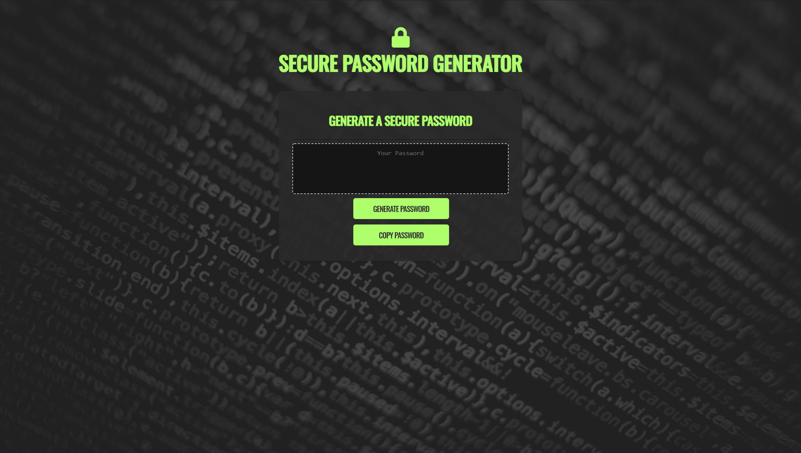

# Secure Password Generator

## Description

This is a secure password generator built with HTML, CSS, and Javascript. The generator takes a users desired password length between 8 and 128 characters, and combines the users desired length with choices bewteen lowercase, uppercase, numeric, and spcecial characters. 

## Usage

To use the generator click the "Generate Password" button, which will prompt you to choose your desired password length and combination of characters. You must select a minimum of 8 characters and no more than 128. You will be prompted with four choices of characters to include, lowercase, uppercase, numeric, and special. You can choose as little as one set of characters or as many as four. The longer you make your password, and the more characters you choose, the more secure your password will be. Once you are finished, the generator will display your secure password in the text area where you can copy it. [https://dbernard87.github.io/secure-password-generator/]

## Features

- Password length between 8 and 128 characters.
- Up to four choices of characters for maximum security.
- Flexbox for responsiveness.
- Media queries for handheld devices.
- Semantic HTML elements for SEO.
- Clean, commented, and consolidated CSS and HTML files.

## Credits

- David Bernard : [https://github.com/dbernard87]
- Background Photo by Markus Spiske from Pexels : [https://www.pexels.com/photo/green-and-yellow-printed-textile-330771/]
- Icons from Font Awesome : [https://fontawesome.com/]
- Stack Overflow : [https://stackoverflow.com/]
- w3schools : [https://www.w3schools.com/]
- w3resource : [https://www.w3resource.com/]